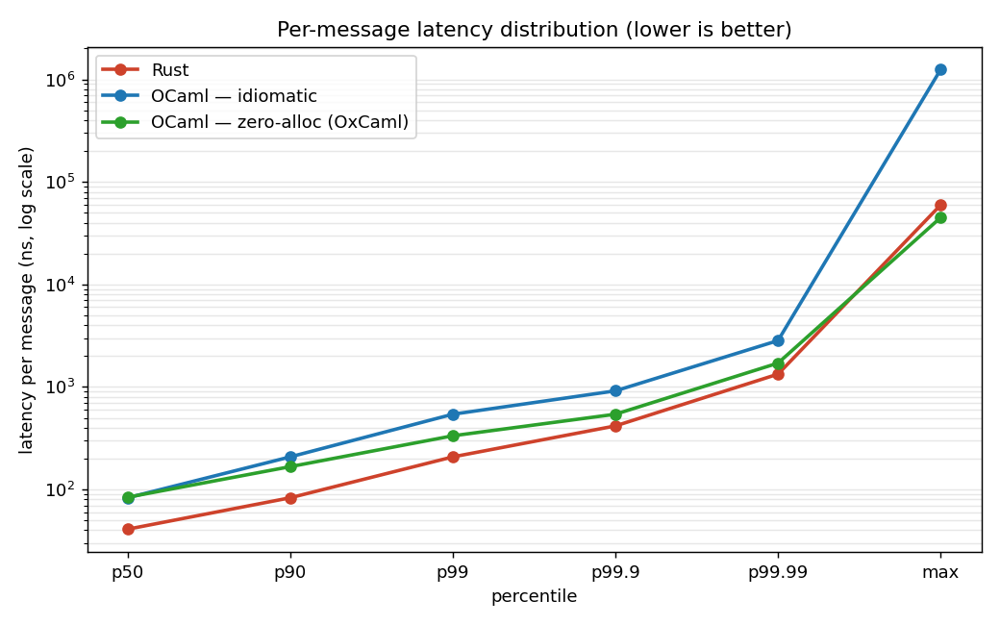
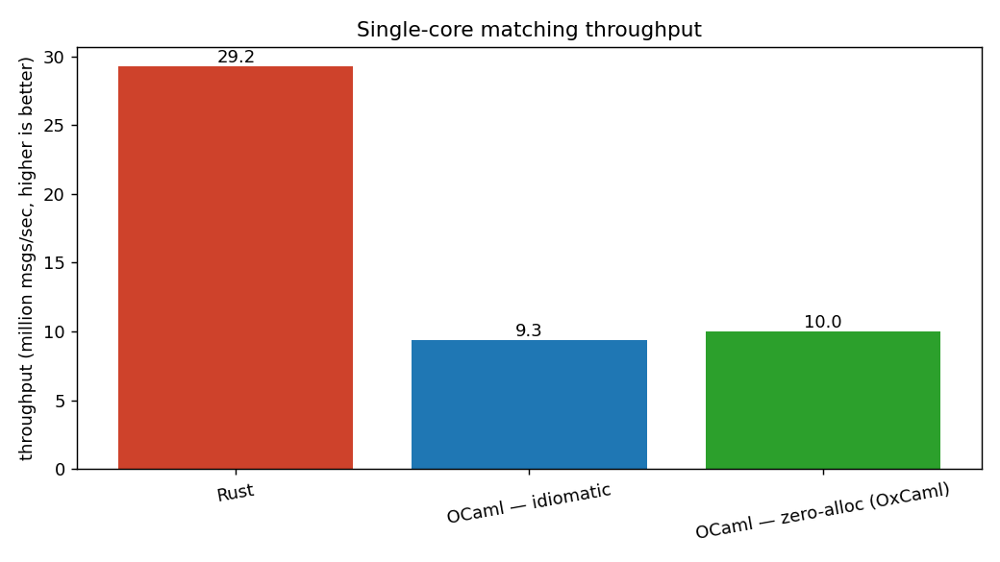

# OCaml vs Rust for low-latency trading — an honest head-to-head

A price-time-priority **limit-order-book matching engine** — the canonical Jane Street workload —
implemented three ways over **byte-identical input**, with rigorous, fair benchmarks:

| | language / mode | what it shows |
|---|---|---|
| **Rust** | stable 1.95, `Vec`-arena + `HashMap`, no GC | the no-GC baseline, and the ownership ceremony it costs |
| **OCaml — idiomatic** | 5.4.1 + flambda, boxed records + `Hashtbl` | clean, ergonomic OCaml — and its GC tax |
| **OCaml — zero-alloc** | OxCaml / flambda2, flat arrays + custom int-map | the rebuttal: Rust-class predictability, no GC |

All three consume the same 5,000,000-message stream and **produce byte-identical trades and book
state** (verified by a committed golden hash) — so the benchmark compares *representations*, not
algorithms. This is the "why OCaml, and why not Rust?" question that Jane Street has answered in
public for over a decade, reduced to something you can run and measure.

> **The short answer this repo supports:** for HFT, the metric that matters is *tail
> predictability*, not average speed. Zero-allocation OCaml matches — even slightly beats — Rust
> at the extreme tail, while costing far less in ceremony than Rust and far less in GC risk than
> idiomatic OCaml. Rust still wins raw throughput by ~3×. That trade — a little throughput for a
> lot of expressiveness and safety — is, in their own words, why Jane Street picks OCaml.

## Results (Apple Silicon, median of 5 runs, 5M messages → 3.12M trades)



**Latency per message (nanoseconds):**

| Engine | p50 | p90 | p99 | p99.9 | p99.99 | **max** |
|---|---:|---:|---:|---:|---:|---:|
| Rust | **41** | **83** | **208** | **417** | **1,334** | 59,500 |
| OCaml — idiomatic | 83 | 208 | 542 | 916 | 2,833 | **1,244,125** |
| OCaml — zero-alloc (OxCaml) | 84 | 167 | 334 | 542 | 1,708 | **44,875** |

**Throughput & allocation:**

| Engine | throughput | allocation on the hot path |
|---|---:|---|
| Rust | **29.2 M msg/s** | ~0 (13 allocations total over 5M msgs) |
| OCaml — idiomatic | 9.3 M msg/s | 3.8 minor words/op → **74 GC cycles** |
| OCaml — zero-alloc | 10.0 M msg/s | **0 words/op → 0 GC cycles** |



## What the numbers actually say

**1. Tail latency — the thing HFT cares about — favours the zero-alloc design.**
Idiomatic OCaml allocates a record per resting order; over 5M messages that triggers 74 minor
collections, and the worst single message takes **1.24 ms** — a GC pause, ~28,000× its median.
The zero-alloc engine allocates *nothing* on the hot path, takes **zero** GC cycles, and its
worst message is **45 µs** — actually *below* Rust's 60 µs worst. When your risk is "a GC pause
mid-quote", eliminating the GC from the hot path matters more than shaving nanoseconds off the
median. This is exactly Jane Street's "zero-allocation style", and the motivation for OxCaml.

**2. Raw throughput and median latency still favour Rust (~3× / ~2×).** We report this plainly.
Part is a more mature optimizer (LLVM vs flambda2 on the OxCaml 5.2 preview), part is Rust's
`hashbrown` `HashMap` (SIMD probing) versus our hand-written OCaml int-map. This matches Jane
Street's own candor: *"we're fighting a fundamental disadvantage… anyone can write fast C++, but
it takes a real expert to write fast OCaml."* OCaml does not magically equal Rust on a hot loop.

**3. The zero-alloc discipline is mostly stock OCaml; OxCaml's job is to make it safe & ergonomic.**
For an *int-keyed* book, OCaml ints are already unboxed, so the only idiomatic allocations were
the boxed node record and `Hashtbl` options/buckets. Removing them (struct-of-arrays / a flat
strided arena + a custom map) is expressible in plain OCaml — it's just less pleasant. OxCaml's
contribution, per its docs, is (a) **unboxed record types** that give this flat layout with
record *syntax*, and (b) a **mode system** that can *prove* a function never allocates and is
data-race free — turning a hand-discipline into a machine-checked one. (Note: OxCaml's SIMD is
x86-only, so unused here on arm64.)

**4. Expressiveness — the other half of the case.** See [`docs/expressiveness/`](docs/expressiveness/):
modelling order status as a sum type makes "cancel an already-filled order" a *compile error*,
and adding an `Iceberg` order kind makes the compiler point at every match that must change.
Rust does this too (and is stricter — a non-exhaustive match is an error, not a warning); the
honest difference is ceremony at scale, which is a productivity judgment, not a benchmark.

## How it's built (and why it's fair)

- **One shared contract** — [`spec/protocol.md`](spec/protocol.md): a fixed 24-byte binary
  message format and exact matching semantics (price-time priority; trade at the maker price;
  market/limit/cancel/replace).
- **One neutral workload** — [`bench/gen_workload`](bench/gen_workload) (Rust, seeded) emits the
  identical byte stream every engine reads. Realistic mix: ~60% add / 30% cancel / 5% replace /
  5% market, prices clustered around a random-walking mid.
- **Identical algorithm + data structure** in all three: an array price ladder for O(1)
  best-price, an index-arena intrusive FIFO per level for O(1) cancel, a hash map id→slot. The
  *only* deliberate difference is representation (boxed records vs flat arrays) and language.
- **Differential testing gate**: `scripts/run_all.sh` fails unless all three reproduce the
  committed golden `trades_hash` + `book_digest`. That equality is what makes the latency
  comparison meaningful — they are provably doing the same work.
- **Fair measurement**: same input bytes; warmup + median-of-N; max opt flags both sides (Rust
  `--release` + `lto=fat` + `codegen-units=1`; OCaml flambda `-O3`); array bounds checks left on
  in *both* OCaml and Rust; per-op timing via the same `mach_absolute_time` source (a zero-alloc
  C stub on the OCaml side) so the clocks match.

```
spec/        the shared protocol + matching spec + golden hash
bench/       gen_workload (Rust), analyze.py, committed charts
rust/        the Rust engine + harness + property tests
ocaml/idiomatic/   boxed-record engine (flambda)
ocaml/oxcaml/      zero-alloc engine (OxCaml / flambda2)
docs/        design, plan, and the expressiveness demo
scripts/run_all.sh build all, run, verify differential, chart
```

## Honest caveats

- **macOS / Apple Silicon is not a production HFT box** — no core isolation, no kernel bypass,
  thermal/scheduler jitter. These are *relative* numbers under identical conditions, not absolute
  production latencies. A Linux box with `taskset` core-pinning would tighten every tail.
- **The OxCaml toolchain is a 5.2 preview**; flambda2 is younger than the LLVM backend behind
  Rust. Some of the throughput gap is toolchain maturity, not language.
- Single symbol, single core, in-memory (no networking/persistence) — by design: that is the
  canonical Jane Street feed-handler/matching hot loop, not a whole exchange.
- Allocation is measured differently per runtime (OCaml `Gc.minor_words`, Rust a counting global
  allocator); both are documented in the harnesses.

## Reproduce

```bash
# OCaml: opam + two switches; Rust: stable 1.95; Python: matplotlib (see below)
opam switch create 5.4.1-flambda ocaml-variants.5.4.1+options ocaml-option-flambda
opam switch create 5.2.0+ox --repos ox=git+https://github.com/oxcaml/opam-repository.git,default
opam install dune core mtime
python3 -m venv bench/.venv && bench/.venv/bin/pip install matplotlib numpy

scripts/run_all.sh            # build all, run, verify differential, render charts
# or: scripts/run_all.sh 1000000 3   # smaller/faster
```

Per-engine tests: `cargo test --manifest-path rust/Cargo.toml`,
`dune test --root ocaml/idiomatic`, `dune test --root ocaml/oxcaml`.

## Sources (Jane Street's own words)

- Yaron Minsky, *OCaml for the Masses* (CACM, 2011) — readability as risk control.
- *Oxidizing OCaml: Locality* & *Introducing OxCaml* (blog.janestreet.com, 2025) — zero-alloc
  style, stack allocation, modes, unboxed types.
- *Performance Engineering on Hard Mode* (Signals & Threads) — the candid GC/boxiness admission.
- *Building Tools for Traders* / *Safe at Any Speed* — the order-book and feed-handler workloads
  (sub-microsecond per message).
- [oxcaml.org](https://oxcaml.org) — modes, stack allocation, unboxed types.

_Built as a demonstration; see `docs/plans/` for the design + implementation plan._
